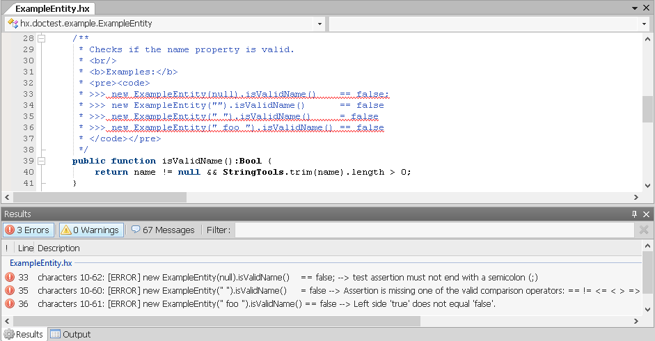

# haxe-doctest - Haxedoc based unit testing.
[](https://travis-ci.org/vegardit/haxe-doctest)
[](http://lib.haxe.org/p/haxe-doctest)
[](#license)

1. [What is it?](#what-is-it)
1. [Declaring test assertions](#declaring-test-assertions)
1. [Why doc-testing?](#why-doc-testing)
1. [Doc-testing with Tink Testrunner](#doctest-with-tink)
1. [Doc-testing with Haxe Unit](#doctest-with-haxeunit)
1. [Doc-testing with MUnit](#doctest-with-munit)
1. [Doc-testing with hx.doctest.DocTestRunner](#doctest-testrunner)
1. [Doc-testing with FlashDevelop](#doctest-testrunner)
1. [Installation](#installation)
1. [Using the latest code](#latest)
1. [License](#license)


## <a name="what-is-it"></a>What is it?

A [haxelib](http://lib.haxe.org/documentation/using-haxelib/) inspired by
Python's [doctest](https://docs.python.org/2/library/doctest.html) command that generates
unit tests based on assertions declared within the Haxedoc comments of source code.

`haxe-doctest` supports the generation of test cases for [Haxe Unit](http://haxe.org/manual/std-unit-testing.html), [MUnit](https://github.com/massiveinteractive/MassiveUnit), and it's own [test runner](#doctest-testrunner) which is recommended for efficient testing from within FlashDevelop.

Requires Haxe 3.2 or higher.

## <a name="declaring-test-assertions"></a>Declaring test assertions

Doc-test assertions are written as part of the source code documentation and are
identified by three leading right angle brackets `>>>` before the assertion.

The left and the right side of the assertion must be separated by one of the comparison operators `<`, `>`, `!=`, `<=`, `>=` or the `throws` keyword.

```haxe
class MyTools {

    /**
     * <pre><code>
     * >>> MyTools.isValidName(null)   == false
     * >>> MyTools.isValidName("")     == false
     * >>> MyTools.isValidName("John") == true
     * </code></pre>
     */
    public static function isValidName(str:String):Bool {
        return str != null && str.length > 0;
    }
}

class MyObject {

    var data:String;

    /**
     * <pre><code>
     * >>> new MyObject(null) throws "[data] must not be null!"
     * >>> new MyObject(null) throws ~/must not be null/
     * >>> new MyObject("ab") throws nothing
     * </code></pre>
     */
    public function new(data:String) {
        if(data == null) throw "[data] must not be null!";
        this.data = data;
    }

    /**
     * <pre><code>
     * >>> new MyObject("ab").length()  > 1
     * >>> new MyObject("ab").length()  <= 2
     * >>> new MyObject("abc").length() != 2
     * </code></pre>
     */
    public function length():Int {
        return data == null ? 0 : data.length;
    }
}
```


## <a name="why-doc-testing"></a>Why doc-testing?

1. Doc-testing supports super fast test-driven development: First you write your method header,
   then the in-place documentation including your test assertions defining the expected behavior
   and then implement until all your declared tests pass.

   No need to create separate test classes with individual test methods.
   Implementing and testing happens at the same code location.

2. For users of your code, the doc-test assertions act as method documentation and code examples.

3. Since doc-testing actually means testing the documentation against the documented code,
   a method's documentation always represents the actual behavior of it's implementation and
   can't get accidently outdated.


## <a name="doctest-with-haxeunit"></a>Doc-testing with [Haxe Unit](https://haxe.org/manual/std-unit-testing.html)

Annotate a class extending `haxe.unit.TestCase` with `@:build(hx.doctest.DocTestGenerator.generateDocTests())`. The doc-test assertions from your source code will then be added as test methods to this class.

```haxe
@:build(hx.doctest.DocTestGenerator.generateDocTests())
class MyHaxeUnitTest extends haxe.unit.TestCase {

    public static function main() {
        var runner = new haxe.unit.TestRunner();
        runner.add(new MyHaxeUnitTest());
        runner.run();
    }

    function new() {
        super();
    }
}
```


## <a name="doctest-with-tink"></a>Doc-testing with [Tink Testrunner](https://github.com/haxetink/tink_testrunner)

Annotate a class extending `tink.testrunner.BasicSuite` with `@:build(hx.doctest.DocTestGenerator.generateDocTests())`. The doc-test assertions from your source code will then be added as test methods to this class.

```haxe
@:build(hx.doctest.DocTestGenerator.generateDocTests())
class MyTinkTestrunnerTest extends tink.testrunner.Suite.BasicSuite {

    public static function main() {
        Runner.run(new MyTinkTestrunnerTest());
    }

    function new() {
        super({name: Type.getClassName(Type.getClass(this))}, []);
    }

}
```


## <a name="doctest-with-munit"></a>Doc-testing with [MUnit](https://github.com/massiveinteractive/MassiveUnit)

Annotate a test class with `@:build(hx.doctest.DocTestGenerator.generateDocTests())`.
The doc-test assertions from your source code will then be added as test methods to this class.

```haxe
@:build(hx.doctest.DocTestGenerator.generateDocTests())
class MyMUnitDocTests {
    public function new() { }
}
```

Then add the test class to a testsuite
```haxe
class MyMUnitDocTestSuite extends massive.munit.TestSuite {
    public static function main() {
        var client = new massive.munit.RichPrintClient();
        var runner = new massive.munit.TestRunner(client);
        runner.run([MyMUnitDocTestSuite]);
    }

    public function new() {
        super();
        add(MyMUnitDocTests);
    }
}
```


## <a name="doctest-testrunner"></a>Doc-testing with hx.doctest.DocTestRunner

haxe-doctest also comes with it's own Testrunner which is recommended for local testing as it generates console output that is parseable by [FlashDevelop](http://www.flashdevelop.org/). When executed from within FlashDevelop, test failures will be displayed in the result panel as clickable errors that directly navigate your to the location in your source code.

To use it, annotate a class extending `hx.doctest.DocTestRunner`  with `@:build(hx.doctest.DocTestGenerator.generateDocTests())`.
The doc-test assertions from your source code will then be added as test methods to this class.

```haxe
@:build(hx.doctest.DocTestGenerator.generateDocTests())
class MyDocTestRunner extends hx.doctest.DocTestRunner {

    public static function main() {
        var runner = new MyDocTestRunner();
        runner.runAndExit();
    }

    function new() { super(); }
}
```

To integrate this with FlashDevelop, create a batch file in your project root folder, e.g. called `test-docs.cmd` containing:
```bat
echo Compiling...
haxe -main mypackage.MyDocTestRunner ^
-cp src ^
-cp test ^
-neko target/neko/MyDocTestRunner.n || goto :eof

echo Testing...
neko target/neko/TestRunner.n
```

In FlashDevelop create a new macro in the macro editor (which is reachable via the menu **Macros -> Edit Macros...**) containing
the following statements.
```bat
InvokeMenuItem|FileMenu.Save
RunProcessCaptured|$(SystemDir)\cmd.exe;/c cd $(ProjectDir) & $(ProjectDir)\test-docs.cmd
```

Then assign the macro a short cut, e.g. [F4].

Now you can write your methods, document their behavior in the doc and by pressing [F4] your changes are saved and the doc-test assertions will be tested. Errors will showup as navigable events in the FlashDevelop's result panel.




## <a name="installation"></a>Installation

1. install the library via haxelib using the command:
    ```
    haxelib install haxe-doctest
    ```

2. use in your Haxe project

   * for [OpenFL](http://www.openfl.org/)/[Lime](https://github.com/openfl/lime) projects add `<haxelib name="haxe-doctest" />` to your [project.xml](http://www.openfl.org/documentation/projects/project-files/xml-format/)
   * for free-style projects add `-lib haxe-doctest`  to `your *.hxml` file or as command line option when running the [Haxe compiler](http://haxe.org/manual/compiler-usage.html)


## <a name="latest"></a>Using the latest code

### Using `haxelib git`

```
haxelib git haxe-doctest https://github.com/vegardit/haxe-doctest master D:\haxe-projects\haxe-doctest
```

###  Using Git

1. check-out the master branch
    ```
    git clone https://github.com/vegardit/haxe-doctest --branch master --single-branch D:\haxe-projects\haxe-doctest
    ```

2. register the development release with haxe
    ```
    haxelib dev haxe-doctest D:\haxe-projects\haxe-doctest
    ```

###  Using Subversion

1. check-out the trunk
    ```
    svn checkout https://github.com/vegardit/haxe-doctest/trunk D:\haxe-projects\haxe-doctest
    ```

2. register the development release with haxe
    ```
    haxelib dev haxe-doctest D:\haxe-projects\haxe-doctest
    ```


## <a name="license"></a>License

All files are released under the [Apache License 2.0](https://github.com/vegardit/haxe-doctest/blob/master/LICENSE.txt).
